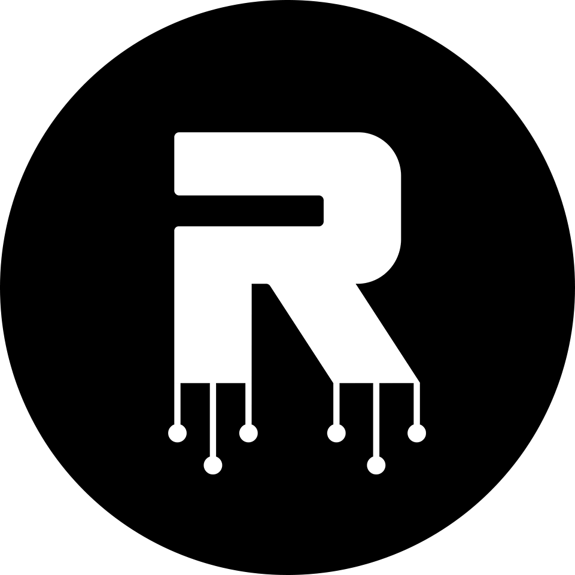

<p align="center">
    
    <h3 align="center">The Root Network Seed 🌱</h3>
</p>

Implementation of [The Root Network](https://therootnetwork.com/) node in Rust, based on the Substrate framework.

This repo contains runtimes for the Root Network Mainnet and Porcini (Testnet). For more specific guides on how to build applications, see the [docs](https://docs.therootnetwork.com).

If you are looking for the chain details for EVM development, checkout [chainlist.org](https://chainlist.org/?search=trn&testnets=true)

## 💫 Features

- L1 Blockchain
- Integrated EVM
- On-Chain Assets
- In-Chain Exchange
- On-Chain Collectible Protocol
- Any-Token Gas
- Identity Protocol
- Cross-Chain Bridge

## ⚙️ Running

### Run using docker image

Docker images are published for every tagged release, you can quickly have a node running without pulling down the source code and build

```bash
# Root chainspec
docker run -p 9933:9933 -p 9944:9944 -p 30333:30333 ghcr.io/futureversecom/seed:latest --chain=root
# Porcini chainspec
docker run -p 9933:9933 -p 9944:9944 -p 30333:30333 ghcr.io/futureversecom/seed:latest --chain=porcini
# Dev chainspec
docker run -p 9933:9933 -p 9944:9944 -p 30333:30333 ghcr.io/futureversecom/seed:latest --dev --unsafe-rpc-external --unsafe-ws-external --rpc-cors=all
```

### Run using source code

First install Rust. You may need to add Cargo's bin directory to your PATH environment variable.

```bash
curl https://sh.rustup.rs -sSf | sh
```

If you already have Rust installed, make sure you're using the latest version by running:

```bash
rustup update
```

Build the client by cloning this repository and running the following commands from the root directory of the repo:

```bash
cargo build --release
```

After building the source code, run the following commands to start the node.

```bash
# Root chainspec
./target/release/seed --chain=root
# Porcini chainspec
./target/release/seed --chain=porcini
# Dev chainspec
./target/release/seed --dev --unsafe-rpc-external --unsafe-ws-external --rpc-cors=all
```

## 🚧 Development

### Getting the right toolchain

To get the right toolchain execute the following command:

```bash
rustup show
```

### Run Unit Tests

```bash
cargo test
```
### Run E2E Tests

Refer to the instruction [here](./e2e)

### Formatting & Linting
```
cargo fmt
```

### Benchmarks

See the [wiki](https://github.com/futureversecom/seed/wiki/How-to-benchmark)

## 📥 Provide Feedback

- [Start a Discussion](https://github.com/futureversecom/trn-seed/discussions) with a question, piece of feedback, or idea you want to share with the team.
- [Open an Issue](https://github.com/futureversecom/trn-seed/issues) if you believe you've encountered a bug that you want to flag for the team.