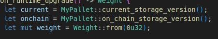

# Introduction
Storage migrations are a crucial part of any blockchain's evolution. Whenever changes are made to the underlying types used in storage values or maps, we need to write migration code to ensure the data remains accessible and accurate. In the next section, we'll cover the circumstances under which storage migrations are necessary, and explain how to approach them.

## When to Migrate
### Changing Underlying Types
If the underlying type used in a storage value or map changes, migration code is necessary. 
Example:
- The type of storage value changed from u32 to MyType
- A new field has been added or removed from MyType
- A field of MyType has structurally changed
- The key of storage map has changed from u32 to u64

### Removing Storages
If we remove an existing storage value or map, we only remove our access to it - the data is still stored on the chain. This means it's important to write migration code to handle the removal of storages.

### Renaming or Removing Pallets
If we rename or remove a pallet, we need to write migration code to manually move or delete all the associated storages. Since all storages are tied to the pallet name, any change to the pallet name requires migration code.

### Moving Storages
As mentioned previously, storages are tied to pallet names. Moving storages from one pallet to another requires migration code.

### Adding a New Pallet
Adding a new Pallet doesn't require us per se to write any migration code, but if we use the storage version constant `const STORAGE_VERSION: StorageVersion = StorageVersion::new(0);` we are required to write a migration for it since just adding the constant doesn't stores the value `0` to the chain's database. Check [On_runtime_upgrade](#on_runtime_upgrade) section for a more detailed explanation. 

## When Not to Migrate
Changes in runtime logic or client changes do not trigger us to write migration code.
Example:
- Adding a new extrinsic parameter
- Adding an additional NFT Tax Fee to all new NFTs
- Adding a new or changing an existing RPC

# Migration Scaffold
Before we can begin writing any migration code, we need to create a scaffold. In this guide, we'll walk through a simple example of a storage value migration for the `Relayer` storage inside the `Xls20` pallet. Note that scaffolding is necessary for any kind of migration, whether it's a simple storage version migration or moving existing storages from one pallet to another.

## Creating the migration file
If a migration file doesn't already exist, we need to create one inside `runtime/src/migrations/`. The file should be named after the pallet that requires migration. To save time, you can duplicate the `example.rs` file and rename it accordingly.

Once you have your file, ensure that you have defined a migration entry point for your pallet. This is done by creating an empty struct and implementing the `OnRuntimeUpgrade` trait. If the migration file already exists or you've copied the example file, this should already be done for you.

An example of the migration entry point struct:
```rust
pub struct Upgrade;
impl OnRuntimeUpgrade for Upgrade {
	#[cfg(feature = "try-runtime")]
	fn pre_upgrade() -> Result<(), &'static str> {
		v1::pre_upgrade()?;

		Ok(())
	}

	fn on_runtime_upgrade() -> Weight {
		let current = MyPallet::current_storage_version();
		let onchain = MyPallet::on_chain_storage_version();
		let mut weight = Weight::from(0u32);

		log::info!(target: "MyPallet", "Running migration with current storage version {current:?} / onchain {onchain:?}");
		if onchain == 0 {
			log::info!(target: "MyPallet", "Migrating from onchain version 1 to onchain version 2.");
			weight += v1::migrate::<Runtime>();

			log::info!(target: "MyPallet", "Migration successfully finished.");
			StorageVersion::new(1).put::<MyPallet>();
		} else {
			log::info!(target: "MyPallet", "No migration was done. If you are seeing this message, it means that you forgot to remove old existing migration code. Don't panic, it's not a big deal just don't forget it next time :)");
		}

		weight
	}

	#[cfg(feature = "try-runtime")]
	fn post_upgrade() -> Result<(), &'static str> {
		v1::post_upgrade()?;

		Ok(())
	}
}
```
This code is a bit lengthy, so let's break it down.

### On_runtime_upgrade
This is the function that will be called to migrate our data. We begin by checking the `current` and `on chain` storage versions.


The `on chain` storage version is the value that is read directly from the chain storage and stored in the node's database. This value can be misleading because if nothing is stored in the storage, the call won't fail and will instead return the default value of zero. This can cause issues when using try-runtime or forking, which is why it's important to always have a value stored in the database and not rely on the default behavior.

The current storage version is the value that is read from the runtime and stored inside the pallet. This value is defined by the const `STORAGE_VERSION` constant and should always be the latest storage version.

You can read the storage version of a pallet directly from the Polkadot JS Apps UI by going to `Developers/chain state/storage` and querying the `palletVersion` field. TODO(Check if that version reflects the `on chain` or `current` storage value)


The rest of the function is self-explanatory. We check if we are on the correct (in this case old) `on chain` version and if so, we run out migrations by calling the `v1::migrate::<Runtime>()` function. Since we are moving from storage version `0` to version `1` the migration is stored inside the `v1` namespace. If we were moving from `1` to `2`, the code would look like this (I removed the logs for brevity reasons)
```rust
if onchain == 1 {
    weight += v1::migrate::<Runtime>();
    StorageVersion::new(2).put::<MyPallet>();
} else {
    // ...
}
```

After the migrate function is complete, the most important part is to update our `on chain` storage value to the correct version. In the example, we update the storage version to 1 using the `StorageVersion::new(1).put::<MyPallet>()` function call.

Note that the `migrate` function and the entire `on_runtime_upgrade` function must not panic or fail. Doing so could cause our chain to halt or something even worse.

### Pre_upgrade and Post_upgrade
These functions are used only when we execute the try-runtime command. There is nothing special about them besides calling the appropriate `pre_upgrade` and `post_upgrade` functions stored in our migration namespaces. Unlike `on_runtime_upgrade`, these functions are allowed to fail.