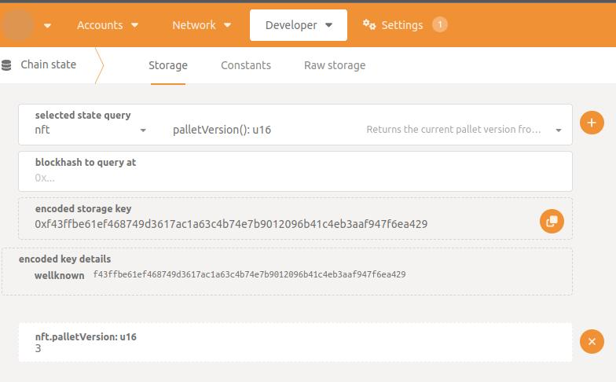

# Introduction
Storage migrations are a crucial part of any blockchain's evolution. Whenever changes are made to the underlying types used in storage values or maps, we need to write migration code to ensure the data remains accessible and accurate. In the next section, we'll cover the circumstances under which storage migrations are necessary, and explain how to approach them.

## When to Migrate
### Changing Underlying Types
If the underlying type used in a storage value or map changes, migration code is necessary. 
Example:
- The type of storage value changed from u32 to MyType
- A new field has been added or removed from MyType
- A field of MyType has structurally changed
- The key of storage map has changed from u32 to u64

### Removing Storages
If we remove an existing storage value or map, we only remove our access to it - the data is still stored on the chain. This means it's important to write migration code to handle the removal of storages.

### Renaming or Removing Pallets
If we rename or remove a pallet, we need to write migration code to manually move or delete all the associated storages. Since all storages are tied to the pallet name, any change to the pallet name requires migration code.

### Moving Storages
As mentioned previously, storages are tied to pallet names. Moving storages from one pallet to another requires migration code.

### Adding a New Pallet
Adding a new Pallet doesn't require us per se to write any migration code, but if we use the storage version constant `const STORAGE_VERSION: StorageVersion = StorageVersion::new(0);` we are required to write a migration for it since just adding the constant doesn't stores the value `0` to the chain's database. Check [On_runtime_upgrade](#on_runtime_upgrade) section for a more detailed explanation. 

## When Not to Migrate
Changes in runtime logic or client changes do not trigger us to write migration code.
Example:
- Adding a new extrinsic parameter
- Adding an additional NFT Tax Fee to all new NFTs
- Adding a new or changing an existing RPC

# Migration Scaffold
Before we can begin writing any migration code, we need to create a scaffold. Note that scaffolding is necessary for any kind of migration, whether it's a simple storage version migration or moving existing storages from one pallet to another.

## Creating the migration file
If a migration file doesn't already exist, we need to create one inside `runtime/src/migrations/`. The file should be named after the pallet that requires migration. To save time, you can duplicate the `example.rs` file and rename it accordingly.

Once you have your file, ensure that you have defined a migration entry point for your pallet. This is done by creating an empty struct and implementing the `OnRuntimeUpgrade` trait. If the migration file already exists or you've copied the example file, this should already be done for you.

An example of the migration entry point struct:
```rust
pub struct Upgrade;
impl OnRuntimeUpgrade for Upgrade {
	#[cfg(feature = "try-runtime")]
	fn pre_upgrade() -> Result<(), &'static str> {
		v1::pre_upgrade()?;

		Ok(())
	}

	fn on_runtime_upgrade() -> Weight {
		let current = MyPallet::current_storage_version();
		let onchain = MyPallet::on_chain_storage_version();
		let mut weight = Weight::from(0u32);

		log::info!(target: "MyPallet", "Running migration with current storage version {current:?} / onchain {onchain:?}");
		if onchain == 0 {
			log::info!(target: "MyPallet", "Migrating from onchain version 1 to onchain version 2.");
			weight += v1::migrate::<Runtime>();

			log::info!(target: "MyPallet", "Migration successfully finished.");
			StorageVersion::new(1).put::<MyPallet>();
		} else {
			log::info!(target: "MyPallet", "No migration was done. If you are seeing this message, it means that you forgot to remove old existing migration code. Don't panic, it's not a big deal just don't forget it next time :)");
		}

		weight
	}

	#[cfg(feature = "try-runtime")]
	fn post_upgrade() -> Result<(), &'static str> {
		v1::post_upgrade()?;

		Ok(())
	}
}
```
This code is a bit lengthy, so let's break it down.

### On_runtime_upgrade
This is the function that will be called to migrate our data. We begin by checking the `current` and `on chain` storage versions.
```rust
let current = MyPallet::current_storage_version();
let onchain = MyPallet::on_chain_storage_version();
```

The `on chain` storage version is the value that is read directly from the chain storage and stored in the node's database. This value can be misleading because if nothing is stored in the storage, the call won't fail and will instead return the default value of zero. This can cause issues when using try-runtime or forking, which is why it's important to always have a value stored in the database and not rely on the default behavior.

The current storage version is the value that is read from the runtime and stored inside the pallet. This value is defined by the const `STORAGE_VERSION` constant and should always be the latest storage version.

You can read the storage version of a pallet directly from the Polkadot JS Apps UI by going to `Developers/chain state/storage` and querying the `palletVersion` field. TODO(Check if that version reflects the `on chain` or `current` storage value)



The rest of the function is self-explanatory. We check if we are on the correct (in this case old) `on chain` version and if so, we run out migrations by calling the `v1::migrate::<Runtime>()` function. Since we are moving from storage version `0` to version `1` the migration is stored inside the `v1` namespace. If we were moving from `1` to `2`, the code would look like this (I removed the logs for brevity reasons)
```rust
if onchain == 1 {
    weight += v1::migrate::<Runtime>();
    StorageVersion::new(2).put::<MyPallet>();
} else {
    // ...
}
```

After the migrate function is complete, the most important part is to update our `on chain` storage value to the correct version. In the example, we update the storage version to 1 using the `StorageVersion::new(1).put::<MyPallet>()` function call.

Note that the `migrate` function and the entire `on_runtime_upgrade` function must not panic or fail. Doing so could cause our chain to halt or something even worse.

### Pre_upgrade and Post_upgrade
These functions are used only when we execute the try-runtime command. There is nothing special about them besides calling the appropriate `pre_upgrade` and `post_upgrade` functions stored in our migration namespaces. Unlike `on_runtime_upgrade`, these functions are allowed to fail.

## Registering our migration entry point
To actually call our migrations, we need to register them inside the `AllMigrations` struct. Here's an example of how this can be done:
```rust
pub struct AllMigrations;
impl OnRuntimeUpgrade for AllMigrations {
	#[cfg(feature = "try-runtime")]
	fn pre_upgrade() -> Result<(), &'static str> {
		example::Upgrade::pre_upgrade()?;
		mypallet::Upgrade::pre_upgrade()?;

		Ok(())
	}

	fn on_runtime_upgrade() -> Weight {
		let mut weight = Weight::from(0u32);
	    weight += example::Upgrade::on_runtime_upgrade();
	    weight += mypallet::Upgrade::on_runtime_upgrade();

		weight
	}

	#[cfg(feature = "try-runtime")]
	fn post_upgrade() -> Result<(), &'static str> {
		example::Upgrade::post_upgrade()?;
		mypallet::Upgrade::post_upgrade()?;

		Ok(())
	}
}
```

In this code, we register our `on_runtime_upgrade`, `pre_upgrade`, and `post_upgrade` functions in the appropriate places.

The `pre_upgrade` and `post_upgrade` functions are only used when executing the `try-runtime` command. In this example, we call the `pre_upgrade` and `post_upgrade` functions for both the `example` and `mypallet` migrations.

The `on_runtime_upgrade` function is called when upgrading the runtime on the actual chain. In this example, we call the `on_runtime_upgrade` function for both the `example` and `mypallet` migrations, and accumulate the returned weights to determine the overall weight of the upgrade.

By properly registering our migrations in the `AllMigrations` struct, we ensure that our migrations are executed in the correct order and with the correct permissions.

## Migration namespace
In the migration namespace we write our core logic that will be executed. Here we also define how the storage used to look like before our changes, pre/post migrations and our unit tests.

```rust
mod v1 {
    // Old storage
    // Here we define our old structs ...

	pub fn migrate<T: pallet_example::Config>() -> Weight {
		// Here is he magic ...

        // At the end we need to write our weights
		<Runtime as frame_system::Config>::DbWeight::get().reads_writes(1, 1)
	}

	#[cfg(feature = "try-runtime")]
	pub fn pre_upgrade() -> Result<(), &'static str> {
		// Storage Version Check...
		// Check for corrupted data...

		Ok(())
	}

	#[cfg(feature = "try-runtime")]
	pub fn post_upgrade() -> Result<(), &'static str> {
		// Storage Version Check...
		// Check for corrupted data...

		Ok(())
	}

	#[cfg(test)]
	mod tests {
		#[test]
		fn migration_test() {
			new_test_ext().execute_with(|| {
				// Preparation ...
                // Insert data ...
				// Run runtime upgrade ...
				// Data Check ...
                // Version Check ...
			});
		}
	}
}
```

### Old storage
In the old storage section we define how the storage used to look like before we have done any changes. For defining such storages we use the `#[storage_alias]` attribute and the corresponding storage type. Here is an example from the `example.rs` file:

This is how the storage used to look like inside the example pallet:
```rust
#[derive(Decode, Encode, Debug, Clone, PartialEq, TypeInfo, MaxEncodedLen, Default)]
pub struct OldType {
    pub value: u32,
    pub removed: u32,
}

#[pallet::storage]
pub type MyValue<T> = StorageValue<_, OldType, ValueQuery>;

#[pallet::storage]
pub type MyMap<T: Config> = StorageMap<_, Twox64Concat, u32, OldType, ValueQuery>;
```

This is how it looks now:
```rust
#[derive(Decode, Encode, Debug, Clone, PartialEq, TypeInfo, MaxEncodedLen, Default)]
pub struct NewType {
	pub value: u32,
}

#[pallet::storage]
pub type MyValue<T> = StorageValue<_, NewType, ValueQuery>;

#[pallet::storage]
pub type MyMap<T: Config> = StorageMap<_, Twox64Concat, u32, NewType, ValueQuery>;
```

This is how we define it in our migration file:
```rust
#[derive(Decode, Encode, Debug, Clone, PartialEq, TypeInfo, MaxEncodedLen, Default)]
pub struct OldType {
    pub value: u32,
    pub removed: u32,
}

#[storage_alias]
pub type MyValue<T: pallet_example::Config> = StorageValue<pallet_example::Pallet<T>, OldType>;

#[storage_alias]
pub type MyMap<T: pallet_example::Config> =
    StorageMap<pallet_example::Pallet<T>, Twox64Concat, u32, OldType>;

pub type OldMyValue<T> = MyValue<T>;
pub type OldMyMap<T> = MyMap<T>;
```

#### Types
Here we are migrating from `OldType` to `NewType`. It's important that in the migration code we define and name the old type just like it was defined in the first place. Hence if the old type was named `ILoveTrees` we would have the same named struct `ILoveTrees` inside the migration. It's important that we define all the types that have changed. If the `value` field from `OldType` was of type `ABC` struct and we changed the `ABC` struct in some manner then we would have to define the `ABC` type in the migration code as well.

#### Storages
The storages in the migration code need to be defined just like they were in the original pallet code. There are three difference that are made:
- Instead of `#[pallet::storage]` attribute we use `#[storage_alias]`
- The first template argument `_` is replaced with the corresponding pallet instance which in our case is `pallet_example::Pallet<T>`
- We don't need to define the last argument `ValueQuery/OptionQuery` since it's irrelevant. 

#### Readability
Since the struct names don't change we can define some helper types in order to make a clearer difference between new and old storages.
```rust
pub type OldMyValue<T> = MyValue<T>;
pub type OldMyMap<T> = MyMap<T>;
```

### Migrate
In the `migrate` function, we define the core logic that will be executed during the migration process. Here is where we read the old storage values and transform them to the new format, remove existing storages or move/rename pallets.

```rust
pub fn migrate<T: pallet_example::Config>() -> Weight {
    // Here is he magic ...

    // At the end we need to write our weights
    <Runtime as frame_system::Config>::DbWeight::get().reads_writes(1, 1)
}
```

### Pre-upgrade and Post-upgrade
The `pre_upgrade` and `post_upgrade` functions are optional and are only used when running the try-`runtime` command. These functions can be used to perform additional checks on the storage data before and after the migration, respectively. For example, we can check that the `on chain` storage value has been changed and/or the migrated storage is not corrupted.

```rust
#[cfg(feature = "try-runtime")]
pub fn pre_upgrade() -> Result<(), &'static str> {
    // Storage Version Check...
    // Check that we actually have some data...
    // Check for corrupted data...

    Ok(())
}

#[cfg(feature = "try-runtime")]
pub fn post_upgrade() -> Result<(), &'static str> {
    // Storage Version Check...
    // Check for corrupted data...

    Ok(())
}
```

### Tests
We need to define tests that ensure the migration process is successful. There we insert some data into the old storage, execute the migration, and verify that the data has been transformed correctly. It's important to write thorough tests to ensure that the migration process is reliable and doesn't introduce any regressions.

```rust
#[cfg(test)]
	mod tests {
		#[test]
		fn migration_test() {
			new_test_ext().execute_with(|| {
				// Preparation ...
                // Insert data ...
				// Run runtime upgrade ...
				// Data Check ...
                // Version Check ...
			});
		}
	}
```

# Practical Example
You can check out `example.rs` to see how a final migration solution looks like and there I have as well showcased all the possible migration techniques. 
Here I will go through some of the common migration techniques and explain them in details:

## Removing storage values
To remove a storage value you can used the predefined `mod.rs/remove_value` function. The inner workings of `remove_value` are quite simple

Code: 
```rust
fn remove_value<Storage, T>() -> Result<(), ()>
{
	if Storage::exists() {
		Storage::kill();
		Ok(())
	} else {
		Err(())
	}
}
```

Example:
```rust
remove_value::<OldMyValue<Runtime>, _>();
// Or
remove_value::<pallet_example::MyValue<Runtime>, _>();
```

We check if the storage exists if so when remove it by calling the kill command and return `OK`, If such storage never existed in the first place an `Err` is returned. The `Ok` and `Err` values in your tests and pre/post code can be used to verify the success of the migration.

## Removing storage maps
To remove a storage maps you can used the predefined `mod.rs/remove_map` function. The inner workings of `remove_map` are quite simple

Code: 
```rust
fn remove_map<Storage, K, V>() -> Result<(), ()>
{
	let res = Storage::clear(u32::MAX, None);
	if res.maybe_cursor.is_some() {
		Ok(())
	} else {
		Err(())
	}
}
```

Example:
```rust
remove_map::<OldMyMap<Runtime>, _, _>();
// Or
remove_map::<pallet_example::MyMap<Runtime>, _, _>();
```

TODO